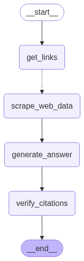

# 🧠 Ask the Web Assistant

A Streamlit app that takes a user's question, retrieves web content, and answers using a verified LLM pipeline powered by LangGraph and Gemini 2.0 Flash.

---

## ⚙️ Workflow

1. **User asks a question**
2. 🔎 `get_links` – Searches DuckDuckGo for relevant pages  
3. 🧽 `scrape_web_data` – Loads and cleans page content  
4. 🧠 `generate_answer` – LLM answers using processed data  
5. ✅ `verify_citations` – Ensures answer cites real sources  
6. 🖥️ Streamlit UI displays answer and debug data  
7. 📊 Optional telemetry is recorded

---

## 🚀 Quick Start

```bash
git clone https://github.com/your-repo/ask-the-web-assistant.git
cd ask-the-web-assistant
pip install -r requirements.txt
streamlit run app.py
````

Or using Docker:

```bash
docker build -t ask-web . && docker run -p 8501:8501 ask-web
```

> ⚠️ Ensure your `.env` has required API keys. See `.env.example`.

---

## 🧱 Architecture



*LangGraph manages stateful steps like scraping, generating, and verifying.*

---

## 📝 Prompt

**Instruction to LLM**:
*"You are a helpful assistant. Based on the following content, answer the user's question truthfully and cite the source."*

*This prompt keeps answers grounded and traceable.*

---

## ⚠️ Limitations

* Citation checks are heuristic, not guaranteed
* Some sites block scraping
* LLMs may hallucinate if context is poor

---


